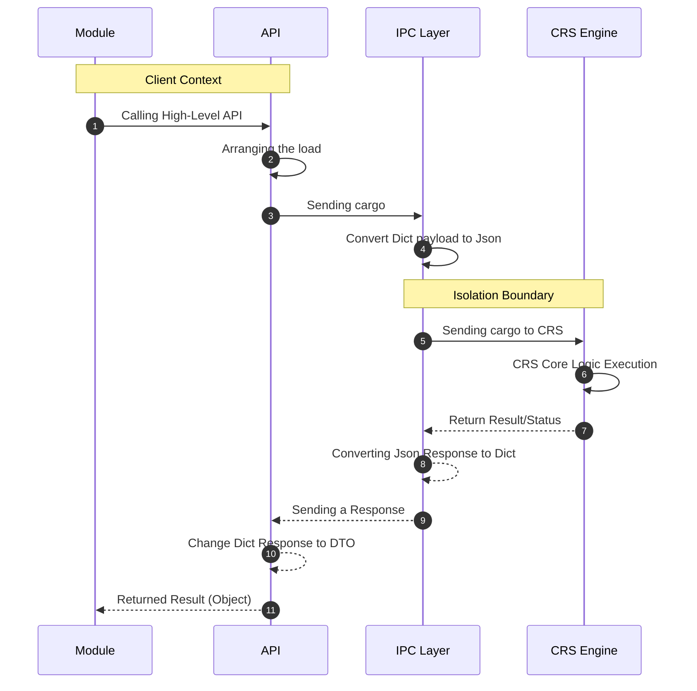

# ⚡ Connection Runtime Service (CRS)

Connection Runtime Service (CRS) is an in-house network & transport engine based on Go (Golang) designed to replace dependency on external/third-party networking libraries (like requests, http_requests, socket, etc.)

By abstracting network communications into a CRS, The system gains full control over transport behavior, memory footprint, security boundaries, and performance optimization through Go's built-in concurrency model.

### ⚙️ Architectural Motivation

- **Dependency Decoupling & Supply Chain Security:** Reduces the risk of vulnerabilities and breaking changes from third-party libraries by isolating all I/O operations into one centralized engine.
- **Performance & Low Latency:** Leverages Go's execution speed and I/O model to minimize overhead when handling high-density communications.
- **Connection Stability:** Provides custom connection pooling management, retry mechanisms, and predictable timeout handling.
- **Concurrency Management:** Leverage native Go Routines to handle concurrent I/O tasks efficiently with controlled resource consumption.

### 📝 Technical Specifications

**Tech Stack & Runtime**
- **Language:** Go (Golang)
- **Primary Paradigm:** Asynchronous / Non-blocking I/O (via Goroutines & Channels)
- **Interface Boundary:** Accessible via Wrapper & IPC Layer

**Supported Protocols & Status**  
Currently CRS implements a subset of network protocols focused on the system's core requirements. Although the protocol coverage is still being developed, the existing implementation has been optimized (tuned) and passed validation testing on various production modules.

### Some of the available;

- **http_requests**: REST API & Web Resource Delivery
- **requests**: DNS Query Resolution or DNS Resolution
- **socket**: Low-level Stream Communication

**Note on Concurrency:** Although Goroutines are widely used across engines, Some specific protocol handlers still use precise synchronous/sequential execution to avoid race conditions or out-of-order execution in stateful protocols.

---

## 🛠️ Ways of working CRS



**Modules:** Just need to call the required **API** and send the data to **CRS**. The module does not need to know or implement any connection or communication mechanisms with the **CRS**.

**Wrapper:** Tasked with compiling `data` received from `module` before forwarding it to **IPC**. The wrapper also handles the response `data` received from **IPC**, then transforms it into a form that is easier for the `module` to use.

**IPC:**  Responsible for managing communications between **Storm** and **CRS**. Upon receiving the first request, **IPC** will start the **CRS** process as a `daemon` if it is not already running. Next `data` is sent to **CRS** via `stdin`, while the response is received by listening to `stdout`.

**CRS:** Runs in a separate process from **Storm** and continues to listen to `stdin` as long as the process is active. When the **Storm** process is terminated, `stdin` will be closed so that **CRS** will detect this condition and terminate itself automatically.

---

## 💡 Protocol Parameters

All protocols definitely have different parameters, here you can learn what parameters the current protocols have.

### 🔌 Socket Parameters

**1. Open Socket**
```python
sock = net.Socket()
sock.socket(addrf, stype, proto)
```
**Inheritance:** `net.Socket()` will inherit all the functions below it, and all of those functions will only return Response.

**Parameter**
- **addrf:** Address Family such as: AF_INET, AF_INET6, AF_UNIX, AF_UNSPEC | str
- **stype:** Sock Type like: SOCK_STREAM, SOCK_DGRAM, SOCK_RAW, SOCK_SEQPACKET | str
- **proto:** Protocols such as: IPPROTO_IP, IPPROTO_ICMP, IPPROTO_TCP, etc. | str | Default 0 = Determined by Kernel UNIX

**Response**
- **status:** SUCCESS/WARNING/ERROR/TIMEOUT.
- **fileno:** This will return the number of File-Decryptor (FD).

**2. Connect to Socket**
```python
sock.connect(host, port, timeout)
```
**Parameter**
- **host:** This can be IP/Hostname.
- **port:** This is a typical port.
- **timeout:** To limit the open connection time.

**Response**
- **status:** SUCCESS/WARNING/ERROR/TIMEOUT.
- **message:** Messages adjust to status.

- **ok:** Return boolean from SUCCESS status. Allows the syntax: if r.ok:
- **isreused:** Returns a Boolean. True=Using the same connection. False=Create a new connection.
- **rtt_ms:** Returns the Round Trip Time in milliseconds.
- **checked_type:** Returns the connection status to see if the tls/tcp connection is working. | Debug.
- **status_tls:** Returns a Boolean. If True=TLS is enabled. False=TLS is disabled.
- **remote_ip:** Returns the target IP:PORT.
- **local_ip:** Returns local IP:PORT.

**3. Send Data**
```python
sock.send(data, timeout)
```
**Parameter**
- **data:** Can be bytes / http request / payload etc.
- **timeout:** To limit the open connection time.

**Response**
- **status:** SUCCESS/WARNING/ERROR/TIMEOUT.
- **message:** Messages adjust to status.

- **ok:** Return boolean from SUCCESS status. Allows the syntax: if r.ok:
- **isreused:** Returns a Boolean. True=Using the same connection. False=Create a new connection.
- **rtt_ms:** Returns the Round Trip Time in milliseconds.
- **checked_type:** Returns the connection status to see if the tls/tcp connection is working. | Debug.
- **status_tls:** Returns a Boolean. If True=TLS is enabled. False=TLS is disabled.

**4. Viewing the buffer**
```python
raw = sock.recv(readsize, timeout)
```
**Parameter**
- **readsize:** To determine how many bytes of buffer to take.
- **timeout:** To limit the open connection time. | Default 300ms.

**Response**
- **status:** SUCCESS/WARNING/ERROR/TIMEOUT.
- **message:** Messages adjust to status.

- **ok:** Return boolean from SUCCESS status. Allows the syntax: if r.ok:
- **raw_bytes:** Returning Raw Bytes.
- **str_bytes:** Returns Raw Bytes as UTF-8.
- **hex_bytes:** Returns Hex Bytes.
- **read_butes:** Returns the number of Bytes.
- **remote_ip:** Returns the target IP:PORT.
- **local_ip:** Returns local IP:PORT.
- **isreused:** Returns a Boolean. True=Using the same connection. False=Create a new connection.
- **rtt_ms:** Returns the Round Trip Time in milliseconds.
- **checked_type:** Returns the connection status to see if the tls/tcp connection is working. | Debug.
- **status_tls:** Returns a Boolean. If True=TLS is active. False=TLS is disabled.


**5. TLS Upgrade**
```python
r = sock.uptls(cert, key, ca, verify)
```
**Parameter**
- **cert:** Path to the certificate file.
- **key:** Path to the Key certificate file.
- **ca:** Path to the CA certificate file.
- **verify:** Boolean. True=Verifying client certificate. False=Skip verification. | Default True.

**Inheritance**  
Automatically inherits TLS connections to send/recv and send/recv usage remains the same.

**Response**
- **status:** SUCCESS/WARNING/ERROR/TIMEOUT.
- **message:** Messages adjust to status.

- **ok:** Return boolean from SUCCESS status. Allows the syntax: if r.ok:
- **raw_bytes:** Returning Raw Bytes.
- **str_bytes:** Returns Raw Bytes as UTF-8.
- **hex_bytes:** Returns Hex Bytes.
- **read_butes:** Returns the number of Bytes.
- **remote_ip:** Returns the server IP:PORT.
- **local_ip:** Returns local IP:PORT.
- **isreused:** Returns a Boolean. True=Using the same connection. False=Create a new connection.
- **rtt_ms:** Returns the Round Trip Time in milliseconds.
- **checked_type:** Returns the connection status to see if the tls/tcp connection is working. | Debug.
- **status_tls:** Returns a Boolean. True=TLS is enabled. False=TLS is disabled.
- **tls:** Responses that inherit TLS information.

**TLS Information**
- **version:** Returns TLS Version 1.0/1.1/1.2/1.3.
- **cipher:** Returning Cipher Suite.
- **protocol:** Returns TLS protocols like h1/h2/h3.
- **hostname:** Returns Host like (example.com).
- **handshake:** Returns a Boolean. True=Handshake succeeded. False=Handshake failed.
- **session_resume:** Returns a Boolean. True=If the TLS session was resumed. False=If the handshake was complete.
- **subject:** Returns the (CN) of the server certificate.
- **issuer:** Returns the (CN) of the (CA) that issued the certificate. Examples: R13, ISRG Root X1, etc.
- **dns_name:** Returns a list of hostnames in the Subject Alternative Name (SAN) extension.
- **expires:** Returns the certificate Expiration Time in RFC3339 format.
- **cert_chain:** Returns the number of certificate chains that were successfully verified.

**6. Timeout**
```python
sock.timeout(value)
```
**Description:** The timeout function is created to set a default timeout for all functions that are executed after it, so that there is no need to implement timeouts repeatedly in each function.

**Value:** In this parameter, the input must be in the form of a float such as: 1.0, 10.5, etc.

**7. Creating Connection**
```python
sock.create_connection(host, port, timeout)
```
**Description:** This function is used to immediately open a connection quickly without having to perform socket() and connect() literacy because this is done automatically by the binary CRS. This makes it faster and requires less code. Send, receive, and uptls still require manual processing afterward.

**8. Closing the connection**
```python
sock.close()
```
**Description:** This is used to close the connection when it is finished or when an error occurs, so that the connection does not hang and to avoid OOM.

---

### ☎️ DNS

**DNS Lookup**
```python
def execute(options, net):
    r = net.DNSL(domain, type, proto, timeout, rl, con)
```
**Description:** DNSL are stateless, and you get a response immediately after each run.

**Parameter**
- **domain:** example.com | str.
- **type:** DNS query type. Example: A, AAAA, TXT, etc. | Default A | str.
- **proto:** Can TCP/UDP | Default TCP.
- **timeout:** To limit the open connection time. | Default 5s
- **rl:** Blocking requests if the token runs out. | Default 150/1s | int.
- **con:** Number of Goroutines for Concurrency, allows to run parallel connections. | int.

**Response**
- **status:** ERROR/SUCCESS/TIMEOUT/WARNING.
- **message:** Messages adjust to status.

- **ok:** Returns a boolean of the SUCCESS status and RCODE is NOERROR (0). Allows the syntax: if r.ok:
- **rcode:** DNS Response Code (example: 0 = NOERROR, 3 = NXDOMAIN).
- **rcode_str:** String representation of RCODE.
- **records:** List of resolution results / answers from DNS server.
- **truncated:** Indicator if the UDP payload is too large and is truncated (will trigger a retry via TCP).
- **authoritative:** Indicator whether the response comes from the Authoritative Name Server directly.

---

### 🖇️ HTTP Requests

**Implementation**
```python
def execute(options, net):
    r = net.HTTPR(method, url, header, body, redirect, rawhttp, tls, verify, retry, rl, timeout, con)
```
**Description:** HTTP Requests are stateless, you can send them and get a response straight away.

**Parameter**
- **method:** GET/POST/DELETE/PUT/dll. | Default GET.
- **url:** https://example.com | str.
- **header:** Example: {"User-Agent": "Storm-Framework/3.0 (X11; Linux x86_64)"} | Dict.
- **body:** Can be empty, can also be filled. | Default empty | str.
- **redirect:** To do a page redirect. | Default True. | Boolean.
- **rawhttp:** Can supply FULL raw HTTP string in the (body). Example: HTTP/1.1\r\nHost: target\r\nX-Injected:  space Strange\r\n\r\n | Default False. | Boolean.
- **tls:** To display TLS information in the Response. | Default False | Boolean.
- **verify:** True=Verifying client certificate. False=Skip verification. | Default True. | Boolean.
- **retry:** Performs Retryable http / Retry connection if failed. | Default 2. | int.
- **rl:** Blocking requests if the token runs out. | Default 150/1s. | int.
- **timeout:** To limit the open connection time. | Default 5s.
- **con:** Number of Goroutines for Concurrency, allows to run parallel connections. | int.

**Response**
- **status:** ERROR/SUCCESS/TIMEOUT/WARNING.
- **message:** Messages adjust to status.

- **status_code:** HTTP Status Code (Example: 200, 404, 500).
- **ok:** HTTP validation shorthand: Transport success and Status Code 2xx / 3xx.
- **text:** Returns the response body in UTF-8 string form.
- **raw_bytes:** Returns the response body in raw bytes.
- **headers:** The original header dictionary from the response.
- **get_headers:** Case-insensitive lookup for HTTP Headers. Example: res.get_headers('content-type') will find 'Content-Type'.
- **proto:** HTTP Protocol (Example: HTTP/1.1, HTTP/2.0).
- **engine:** The connection provider engine from CRS (Example: retryablehttp).
- **tls:** Responses that inherit TLS information.
- **json:** Parses the string body into a JSON dict/list. Returns None if the body is not a valid JSON format.

**TLS Information**
- **version:** Returns TLS Version 1.0/1.1/1.2/1.3.
- **cipher:** Returning Cipher Suite.
- **protocol:** Returns TLS protocols like h1/h2/h3.
- **hostname:** Returns Host like (example.com).
- **handshake:** Returns a Boolean. True=Handshake succeeded. False=Handshake failed.
- **session_resume:** Returns a Boolean. True=If the TLS session was resumed. False=If the handshake was complete.
- **subject:** Returns the (CN) of the server certificate.
- **issuer:** Returns the (CN) of the (CA) that issued the certificate. Examples: R13, ISRG Root X1, etc.
- **dns_name:** Returns a list of hostnames in the Subject Alternative Name (SAN) extension.
- **expires:** Returns the certificate Expiration Time in RFC3339 format.
- **cert_chain:** Certificate chain successfully verified against a trusted root CA.

### 🔌 Telnet

**1. Open koneksi**
```python
def execute(options, net):
    r = net.Telnet(host, port, timeout)
```
**Description:** Telnet is stateful, you will get inherited functions.

**Parameter**
- **host:** This can be IP / Domain.
- **port:** This is a typical port.
- **timeout:** To limit the open connection time. | Default 10.0s.

**Inheritance**  
You will get the legacy `send` and `read` functions.

**2. Send Data**
```python
res, var = r.send(command, expected, timeout, raw)
```
**Parameter**
- **command:** This can be filled with a wordlist file of username or password or a free command or bytes.
- **expected:** This can contain the desired response expectation variables.
- **timeout:** To limit the open connection time. | Default 0.3s.
- **raw:** This is a boolean if True: The first response is Bytes. If False: The first response is a UTF-8 decoded string. | Default False.

**Response**
- **res:** This will contain the raw bytes response.
- **var:** Can contain a variable number of expectation parameters. For example, there are two expectation variables, so the response variable is calculated as 0 and 1. If it is below 0 such as -1 or -2 etc. it is considered False or not found.

**3. Read Response**
```python
res, var = r.read(expected, timeout, raw)
```

**Parameter**
- **expected:** This can contain the desired response expectation variables.
- **timeout:** To limit the open connection time. | Default 0.3s.
- **raw:** This is a boolean if True: The first response is Bytes. If False: The first response is a UTF-8 decoded string. | Default False.


**Response**
- **res:** This will contain the raw bytes response.
- **var:** Can contain a variable number of expectation parameters. For example, there are two expectation variables, so the response variable is calculated as 0 and 1. If it is below 0 such as -1 or -2 etc. it is considered False or not found.

---

### 📡 Use of Response & Inheritance

**1. Socket**

- **Status:** `Stateful`
- **Inheritance**
```python
sock = net.Socket()

# Open Socket
sock.socket(addrf, stype, proto)

# Open connection to Socket
sock.connect(host, port, timeout)

# Send Data
sock.send(data, timeout)

# Buffer Fetching
sock.recv(readsize, timeout)

# TLS Upgrade has legacy
sock.uptls(cert, key, ca, verify)

# Automatically be on a TLS encrypted connection
sock.send()
sock.recv()

# Closing Connection
sock.close()

# Timeout function
sock.timeout(value)
```

- **Response**
```python
# send data
r = sock.send(data, timeout)
smf.printf(r.status, r.message)
smf.printf(r.isreused, r.rtt_ms, etc.)

# read buffer
r = sock.recv(readsize)
smf.printf(r.status, r.message)
smf.printf(r.raw_bytes, r.hex_bytes, etc.)

# TLS Upgrade
r = sock.uptls(cert, key, ca, verify)
smf.printf(r.status, r.message)
smf.printf(r.tls.version, r.tls.cipher, etc.)
```

**2. DNS Lookup**

- **Status:** `Stateless`
- **Response**
```python
r = net.DNSL(...)
smf.printf(r.status, r.message)
smf.printf(r.rcode, r.records, etc.)

# Boolean SUCCESS
if r.ok:
```

**3. HTTP Requests**

- **Status:** `Stateless`
- **Response**
```python
r = net.HTTPR(...)
smf.printf(r.status, r.message)
smf.printf(r.status_code, r.tls.cipher, etc.)

# Boolean SUCCESS
if r.ok:
```

**4. Telnet**

- **Status:** `Stateful`
- **Inheritance**
```python
# Open Connection
r = net.Telnet(...)

# Viewing the response
raw, var = r.read(...)
smf.printf(raw) # Return raw bytes response.
smf.printf(var) # Return Amount expected.

# Sending data
raw, var = r.send(...)
smf.printf(raw) # Return raw bytes response.
smf.printf(var) # Return Amount expected.

if var < 0: # -1 = Beyond expected.
if var >= 0: # 0+ = As expected.
```


