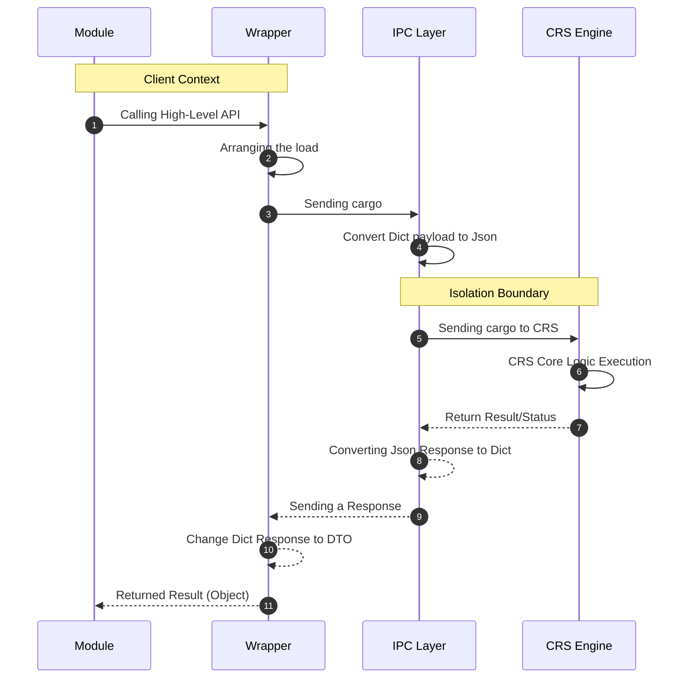

# ⚡ Connection Runtime Service (CRS)

Connection Runtime Service (CRS) is an in-house network & transport engine based on Go (Golang) designed to replace dependency on external/third-party networking libraries (like requests, http_requests, socket, etc.)

By abstracting network communications into a CRS, The system gains full control over transport behavior, memory footprint, security boundaries, and performance optimization through Go's built-in concurrency model.

### Architectural Motivation

- **Dependency Decoupling & Supply Chain Security:** Reduces the risk of vulnerabilities and breaking changes from third-party libraries by isolating all I/O operations into one centralized engine.
- **Performance & Low Latency:** Leverages Go's execution speed and I/O model to minimize overhead when handling high-density communications.
- **Connection Stability:** Provides custom connection pooling management, retry mechanisms, and predictable timeout handling.
- **Concurrency Management:** Leverage native Go Routines to handle concurrent I/O tasks efficiently with controlled resource consumption.

### Technical Specifications

**Tech Stack & Runtime**
- **Language:** Go (Golang)
- **Primary Paradigm:** Asynchronous / Non-blocking I/O (via Goroutines & Channels)
- **Interface Boundary:** Accessible via Wrapper & IPC Layer

**Supported Protocols & Status**  
Currently CRS implements a subset of network protocols focused on the system's core requirements. Although the protocol coverage is still being developed, the existing implementation has been optimized (tuned) and passed validation testing on various production modules.

### Some of the available;

- **http_requests**: REST API & Web Resource Delivery
- **requests**: DNS Query Resolution or DNS Resolution
- **socket**: Low-level Stream Communication

**Note on Concurrency:** Although Goroutines are widely used across engines, Some specific protocol handlers still use precise synchronous/sequential execution to avoid race conditions or out-of-order execution in stateful protocols.

---

## Ways of working CRS



**Modules:** Just need to call the required **API** and send the data to **CRS**. The module does not need to know or implement any connection or communication mechanisms with the **CRS**.

**Wrapper:** Tasked with compiling `data` received from `module` before forwarding it to **IPC**. The wrapper also handles the response `data` received from **IPC**, then transforms it into a form that is easier for the `module` to use.

**IPC:**  Responsible for managing communications between **Storm** and **CRS**. Upon receiving the first request, **IPC** will start the **CRS** process as a `daemon` if it is not already running. Next `data` is sent to **CRS** via `stdin`, while the response is received by listening to `stdout`.

**CRS:** Runs in a separate process from **Storm** and continues to listen to `stdin` as long as the process is active. When the **Storm** process is terminated, `stdin` will be closed so that **CRS** will detect this condition and terminate itself automatically.

---

## Protocol Parameters

All protocols definitely have different parameters, here you can learn what parameters the current protocols have.

### Socket Parameters

**1. Open Connection**

```python
def execute(options, net):
    s = net.Socket(host, port, timeout)
```
**Parameter**
- **host:** This can be IP/http, for example http://ip:port.
- **port:** This is a typical port.
- **timeout:** To limit the open connection time.

**Inheritance**  
Just inherit the child classes of Socket like recv, send, uptls.

**2. Send data**

```python
s.send(data, timeout)
```
**Parameter**
- **data:** Can be bytes / http request / payload etc.
- **timeout:** To limit the open connection time.

**Response**
- **status:** SUCCESS/WARNING/ERROR/TIMEOUT.
- **message:** Messages adjust to status.

- **isreused:** Returns a Boolean. True=Using the same connection. False=Create a new connection.
- **rtt_ms:** Returns the Round Trip Time in milliseconds.
- **checked_type:** Returns the connection status to see if the tls/tcp connection is working. | Debug.
- **status_tls:** Returns a Boolean. If True=TLS is enabled. False=TLS is disabled.

**3. Viewing the buffer**

```python
raw = s.recv(readsize)
```
**Parameter**
- **readsize:** To determine how many bytes of buffer to take.

**Response**
- **status:** SUCCESS/WARNING/ERROR/TIMEOUT.
- **message:** Messages adjust to status.

- **raw_bytes:** Returning Raw Bytes.
- **str_bytes:** Returns Raw Bytes as UTF-8.
- **hex_bytes:** Returns Hex Bytes.
- **read_butes:** Returns the number of Bytes.
- **protocol:** Restore TCP/TLS.
- **remote_ip:** Returns the target IP:PORT.
- **local_ip:** Returns local IP:PORT.
- **isreused:** Returns a Boolean. True=Using the same connection. False=Create a new connection.
- **rtt_ms:** Returns the Round Trip Time in milliseconds.
- **checked_type:** Returns the connection status to see if the tls/tcp connection is working. | Debug.
- **status_tls:** Returns a Boolean. If True=TLS is active. False=TLS is disabled.


**4. TLS Upgrade**

```python
r = s.uptls(cert, key, ca, verify)
```
**Parameter**
- **cert:** Path to the certificate file.
- **key:** Path to the Key certificate file.
- **ca:** Path to the CA certificate file.
- **verify:** Boolean. True=Verifying client certificate. False=Skip verification. | Default True.

**Inheritance**  
Automatically inherits TLS connections to send/recv and send/recv usage remains the same.

**Response**
- **status:** SUCCESS/WARNING/ERROR/TIMEOUT.
- **message:** Messages adjust to status.

- **raw_bytes:** Returning Raw Bytes.
- **str_bytes:** Returns Raw Bytes as UTF-8.
- **hex_bytes:** Returns Hex Bytes.
- **read_butes:** Returns the number of Bytes.
- **protocol:** Restore TCP/TLS.
- **remote_ip:** Returns the target IP:PORT.
- **local_ip:** Returns local IP:PORT.
- **isreused:** Returns a Boolean. True=Using the same connection. False=Create a new connection.
- **rtt_ms:** Returns the Round Trip Time in milliseconds.
- **checked_type:** Returns the connection status to see if the tls/tcp connection is working. | Debug.
- **status_tls:** Returns a Boolean. True=TLS is enabled. False=TLS is disabled.
- **tls:** Responses that inherit TLS information.

- **version:** Returns TLS Version 1.0/1.1/1.2/1.3.
- **cipher:** Returning Cipher Suite.
- **protocol:** Returns TLS protocols like h1/h2/h3.
- **hostname:** Returns Host like (example.com).
- **handshake:** Returns a Boolean. True=Handshake succeeded. False=Handshake failed.
- **session_resume:** Returns a Boolean. True=If the TLS session was resumed. False=If the handshake was complete.
- **subject:** Returns the (CN) of the server certificate.
- **issuer:** Returns the (CN) of the (CA) that issued the certificate. Examples: R13, ISRG Root X1, etc.
- **dns_name:** Returns a list of hostnames in the Subject Alternative Name (SAN) extension.
- **expires:** Returns the certificate Expiration Time in RFC3339 format.
- **cert_chain_count:** Returns the number of certificate chains that were successfully verified.


