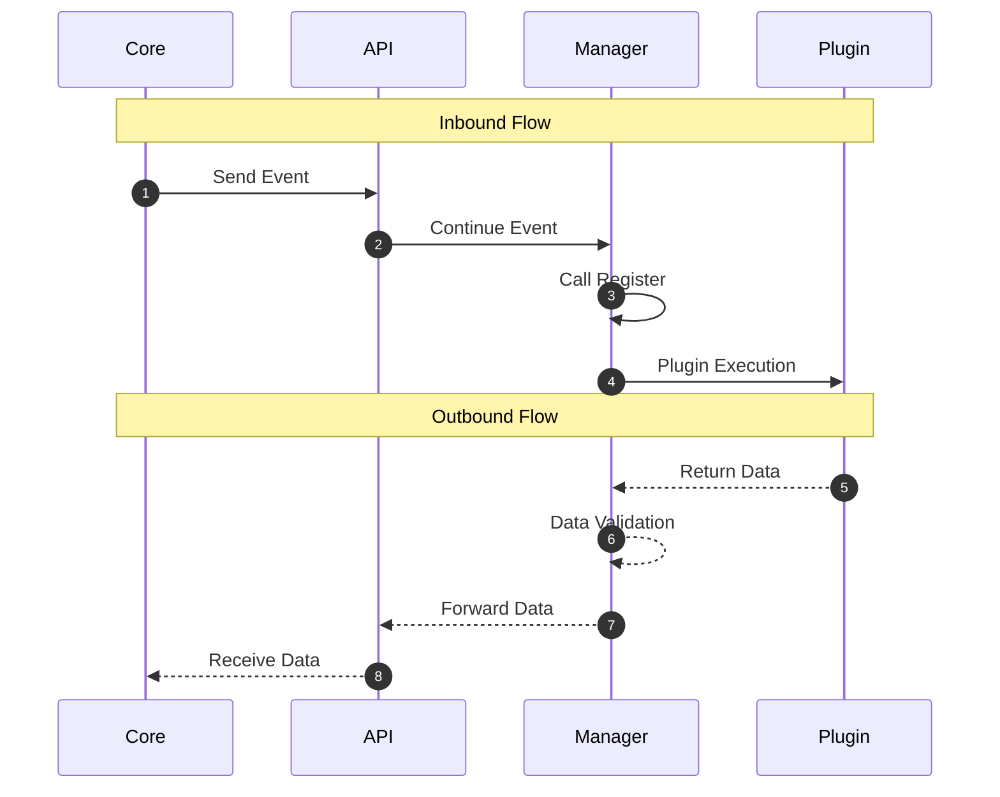

# PLUGIN DEVELOPER

The plugins here employ different mechanisms and rules depending on their specific structures; we provide this explanation as a roadmap to ensure you don't get confused when contributing to the creation of a new plugin.


## RULES

- **OOP:** A single file may contain multiple classes, but the entry point must be named `class Plugin` and include an `execute` method to serve as the entry point (along with a `teardown` method if using the `asyncio` or `threading` libraries, to allow for proper shutdown when the user runs `unload`). Additionally, the plugin must implement the global flag `__autorun__ = True` if it is intended to run passively; otherwise, set `__autorun__ = False` and return the data as a dictionary.

- **Function:** The design is intended to allow multiple logic flows to run within a single file; however, you must ensure that each entry point function's name accurately reflects its logic. Additionally, use parameters that prevent errors if a caller attempts to pass arguments that do not actually exist (e.g., `def b64(*args, **kwargs) -> Dict:`). For helper functions, prefix the function name with an underscore to indicate that it is not a primary entry point. Return the data as a dictionary—for example: `return {"b64": f"{results}"}`.


## EXAMPLE OF USE

**plugin:**
```bash
# --- HELP FUNCTION (Internal Helpers) ---
def _clean_input(text: str) -> str:
    return text.strip()

def _format_output(result: str) -> dict:
    return {"payload": result}


# --- MAIN ENTRY POINT ---
def process_payload(*args, **kwargs) -> dict:
    cleaned = _clean_input(args)
    encoded = cleaned.encode("utf-8").hex()
    return _format_output(encoded)
```

**use plugin:**
```bash
# Calling Entry Point 1
res1 = broadcast("b64", "hello", mode="encode")
# Result: {"b64": "aGVsbG8="}

# Calling Entry Point 2
res2 = broadcast("xor", "hello", key=42)
# Result: {"xor": "...\x1f\x1e\x16\x16\x1f"}
```

### EXECUTION FLOW


